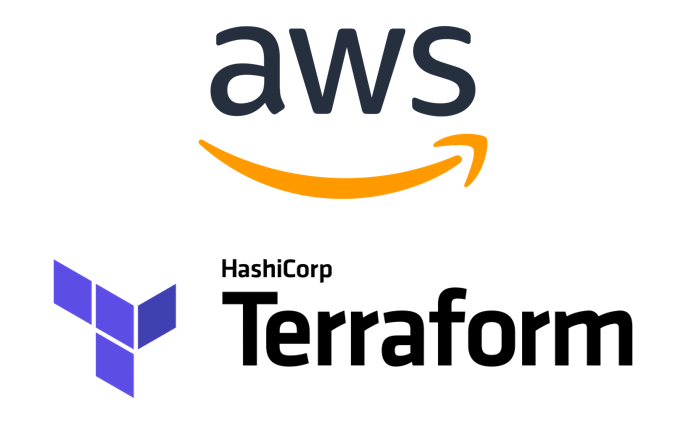
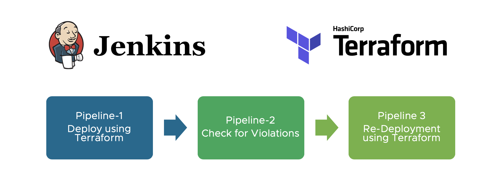

# Introduction 
This is the Sample Terraform exercise for Infrastructure as a Code  for Amazon Web Services AWS.

# Pre-requisite 
It is required to install following packages and tools on your local machine.
1.	Visual Studio Code [link](https://code.visualstudio.com/)  
3.	Terraform  (https://www.terraform.io/downloads.html)
4.	Amazon Web Services  CLI  (https://aws.amazon.com/cli/)
5.  Git Bash on Windows (https://git-scm.com/downloads)
 

# Contribute
- Tapan N. Banker 

# NOTES
- Developers will work on /feature branches. The /feature branch will be created from the /develop branch. The /develop branch shall be the primary development activity branch for the team.
- The developers and engineer will contribute the code into the /feature branches respectively. 

# Initial Terraform Setup  
```
terraform -version 
```

# 3.	Tools to Validate Terraform Code
```
terraform init
terraform fmt
terraform plan
terraform show
terraform validate
terraform apply -auto flag
```
   
# Repository Structure
A description of the structure of the code is found below. It will help navigate through the proposed example:

```
|-- README.md
`-- terraform
|-- examples
`-- modules
```

# AWS Infrastructure Terraform Pipeline
- Embracing Infrastructure as Code (IaC) as a main approach to design, provide, develop and maintain their cloud infrastructure. IaC ensures reproducibility and scalability of their infrastructure while at the same time it allows DevOps to adopt best practices and paradigms.
- Once the code is committed or the Pull Request (PR) are merged from /feature branch into /develop branch , the Jenkins CI/CD or AWS Code Pipeline DevOps will trigger the pipeline  automatically.
- https://aws.amazon.com/blogs/developer/build-infrastructure-ci-for-terraform-code-leveraging-aws-developer-tools-and-terratest/

- Once the Continous Integration CI Pipeline #1 is completed the #2 Pipeline that is Terraform Release pipeline will trigger automatically.



# Terraform Remote State Management 
Terraform state is used to reconcile deployed resources with Terraform configurations. State allows Terraform to know what Azure resources to add, update, or delete. Terraform supports the persisting of state in remote storage.
## Terraform AWS S3buckets
 

## Steps to create feature branch from the develop branch
```
git fetch origin develop
git pull
git checkout develop
git checkout -b feature/<<name-of-branch>>
git push origin feature/<<name-of-branch>>
git push origin feature/backupaug03-dev
git push --set-upstream origin feature/backupaug03-dev
git push --set-upstream origin feature/<<name-of-branch>>
--------------- For Example, the feature branch name is feature/jira-4356-team
git fetch
git pull
git checkout develop
git checkout -b feature/jira-4356-team
git push origin feature/jira-4356-team
git push --set-upstream origin feature/jira-4356-team
```

## Switch to a feature branch
```
git fetch --all
git pull
git checkout feature/<<name-of-branch>
--------------- For Example, the feature branch name is feature/jira-4356-team
git fetch --all
git pull
git checkout feature/jira-4356-team
```
##  Take the latest code from develop to YOUR own feature branch
```
git fetch --all
git pull
git checkout develop
git fetch --all
git pull
git checkout feature/<<name-of-branch>
git pull
git merge origin/develop
--------------- For Example, the feature branch name is feature/jira-4356-team. The goal is to take the code
form develop (changed) into the feature/jira-4356-team
git fetch --all
git pull
git checkout develop
git fetch --all
git pull
git checkout feature/jira-4356-team
git pull
git merge origin/develop
```
## Pushing Code in the feature branch
```
git checkout feature/<<Branch-Name>>
git add .
git commit -m "Provide a message explaining briefly what is changed and feature"
git push
--------------- For Example, if the feature branch name is feature/jira-4356-team
git checkout feature/jira-4356-team
<<< Write Code, make changes, develop features >>>
git add -A .
git commit -m "Put message on the commits, Fixed oAuth and URLs"
git push
``` 
 
## Terraform Remote State Pull (if needed)
```
terraform state pull
``` 
